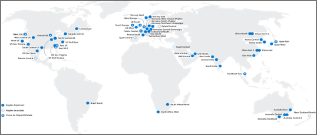
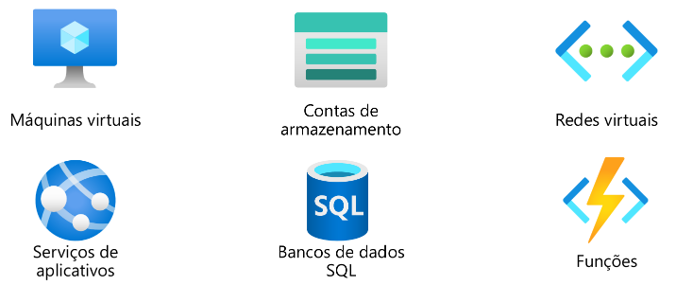
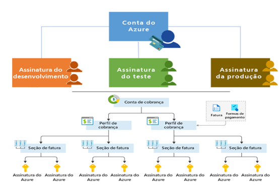

<h1 align="center"> Componentes de Arquitetura do Azure </h1>

## Regiões

Quando vamos escolher onde colocar um recurso, podemos colocar na região mais próxima de onde precisamos

Diminuindo a latência e aumentando a disponibilidade.

Alguns recursos não estão disponíveis em determinadas regiões.

Podemos também escolher regiões por questão de preço, algumas regiões são mais baratas que outras.

O Azure oferece mais regioões globais que qualquer outro provedor de nuvem, com mais de 60 regiões representando mais de 140 países.

As regiões são compostas de um ou mais datacenters muito próximos.

Eles fornecem flexibilidade e escala para reduzir a latência do cliente.

As regiões preservam a residência dos dados com uma oferta abrangente de conformidade.

## Disaster Recovery
Trabalhar com mais de um datacenter, se caso um cair, suas aplicações estando disponivel replicados em outra zona de disponibilidade continua online (ou outra região)

Para o sistema redundante ideal

LGPD

Alguns dados não podem ser levados para fora do Brasil

Questões ao se criar um recurso:

    -Quanto precisa de disponibilidade
    -Que região precisa ficar
    -Vai ficar ligado o tempo todo ou vai desligar pra economizar
    -É um sistema de teste, prod, homolog

## Zonas de disponibilidade

Fornece proteção contra tempo de inatividade devido a falha do datacenter

Separe fisicamente os datacenters dentro da mesma região

Cada datacenter é equipado com alimentação, resfriamento e rede independentes.

Conectadas por meio de redes privadas de fibra óptica.

<h1 align="center"> Entendendo Pares de Região e Grupos </h1>

## Pares de regiões

Cada região possui uma região par que vai atuar como uma zona secundária quando tivermos problemas de indisponibilidade na região original.

No mínimo 300 milhas de separação entre pares de regiões

Replicação automática para alguns serviços

Recuperação de região priorizada em caso de interrupção

As atualizações são distribuidas sequencialmente para minimizar o tempo de inatividade.

[Pares de Regiões - Microsoft](https://aka.ms/PairedRegions-ptb)

## Regiões Soberanas do Azure

Regiões exclusivas que não são disponibilizadas para o público em geral

Serviço Governamentais dos EUA

Atende às necessidades de segurança e conformidade das agências federais, governos estaduais e locais dos EUA e seus provedores de soluções.

### Azure Governamental:

Instância separada do Azure

Fisicamente isolada de implantações que não sejam do governo dos EUA

Acessível somente a pessoal verificado e autorizado

### Azure China:

A Microsoft é o primeiro provedor estrangeiro de serviços de nuvem pública da China, em conformidade com as regulamentações governamentais.

Instância fisicamente separada dos serviços de nuvem do Azure operados pela 21Vianet.

Todos os dados permanecem dentro da China para garantir a conformidade.

## Recursos do Azure

Os recursos do Azure são componentes como armazenamento, máquinas virtuais e redes que estão disponíveis para criar soluções de nuvem.

## Grupo de Recursos

Maneira de organizar os recursos que você cria

Um grupo de recursos é um contêiner que você usa para gerenciar e agregar recursos em uma única unidade.

Os recursos podem existir em apenas um grupo de recursos.

Os recursos podem existir em diferentes regiões

Os recursos podem ser movidos para diferentes grupos de recursos

Os aplicativos podem utilizar vários grupos de recursos

Uma vez criado um grupo, não é possível renomear

<h1 align="center"> Assinatura do Azure e Grupos de Gerenciamento </h1>

## Assinaturas do Azure

Quando criamos nossa conta da azure, temos apenas uma assinatura do azure

Mas podemos ter várias assinaturas de para vários setores e times

Uma conta pode ter várias assinaturas, mas uma assinatura só pode estar associada a apenas uma conta.

Muitas empresas usam assinaturas por projeto, Como um centro de custo

Os recursos receberão uma conta de cobrança separados por assinatura

Uma assinatura do Azure fornece a você acesso autenticado e autorizado às contas do azure.

### Limite de cobrança:

gere relatórios de cobrança e faturas separados para cada assinatura.

### Limite de controle de acesso:

gerenciar e controlar o acesso aos recursos que os usuários podem provisionar com assinaturas específicas.

## Grupos de gerenciamento

Os grupos de gerenciamento podem incluir váruas assinaturas do azure

as assinaturas herdam as condições aplicadas ao grupo de gerenciamento

