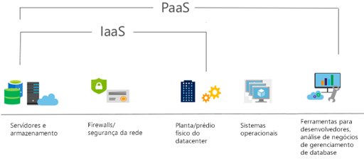
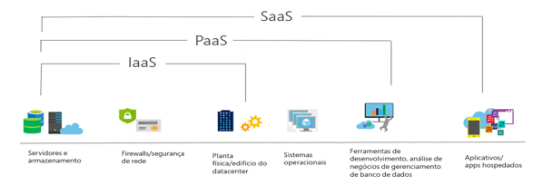

<h1 align="center"> Tipos de Serviço de Nuvem na Azure </h1>

<h2 align="center"> IaaS, PaaS e SaaS </h2>

### IaaS - Infraestrutura como serviço

    O serviço de nuvem mais flexível.
    Você configura e gerencia o hardware para seu aplicativo.
    Mais utilizado, tendem a ser recursos/serviços onde nós como clientes vamos ter mais acesso.
    Nos envolvemos mais, com configuração, monitoramento, backup, etc.
    Mais acesso na personalização e liberdade para trabalhar.

### PaaS - Plataforma como serviço

    Focado no desenvolvimento de aplicativos.
    O gerenciamento de plataforma é realizado pelo provedor de nuvem.
    Pode criar o ambiente sem se preocupar com o sistema operacional

### SaaS - Software como serviço

    Modelos de preço de pagamento conforme o uso.
    Os usuários pagam pelo software que utilizam em um modelo de assinatura.
    Pode criar o ambiente sem se preocupar com o sistema operacional
    Os usuários se conectam e usam aplicativos com base em nuvem pela internet como por ex office 365, email e calendários

# 
# 
# 

<h1 align="center"> Modelo de responsabilidade compartilhada </h1>

    A responsabilidade compartilhada varia de acordo com o tipo de serviço, como podemos observar na tabela.

## Links

[Introdução](https://learn.microsoft.com/training/modules/describe-cloud-service-types/1-introduction)

[IaaS](https://learn.microsoft.com/training/modules/describe-cloud-service-types/2-describe-infrastructure-service)

[PaaS](https://learn.microsoft.com/training/modules/describe-cloud-service-types/3-describe-platform-service)

[Saas](https://learn.microsoft.com/training/modules/describe-cloud-service-types/4-describe-software-service)
